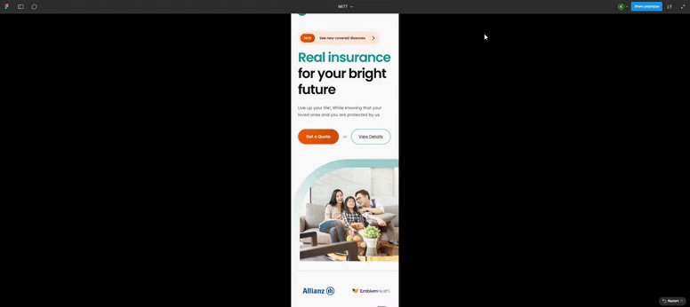
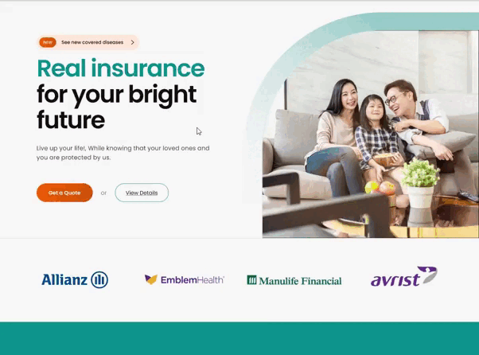
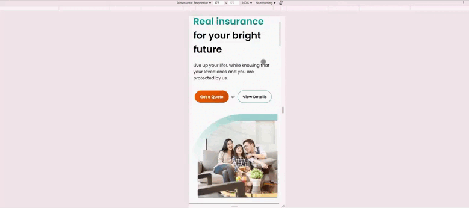
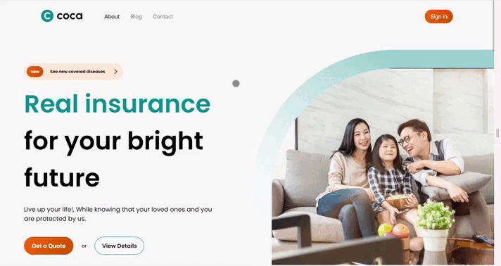

# Projeto de Desenvolvimento Front-End  

## Identificação  
**Aluno(a):** Kael Luih de Araujo
**Projeto:** Desenvolvimento de Interface Web a partir de Layout no Figma  

---

## 📌 Descrição do Projeto  
Este projeto consiste no **desenvolvimento de uma interface web front-end** a partir de um protótipo previamente elaborado no **Figma**.  
O trabalho tem como foco:  

- A **fidelidade ao design** original.  
- A aplicação de **princípios de responsividade**, permitindo uma navegação adequada em diferentes dispositivos.  
- O uso de **HTML semântico** para melhor estruturação do conteúdo.  
- Adoção de **boas práticas em CSS**, com utilização de variáveis, estratégia *mobile first* e *media queries*.  

---

## 🛠 Tecnologias Utilizadas  

- **HTML5** – Estrutura semântica do conteúdo.  
- **CSS3** – Estilização, variáveis CSS, responsividade (*mobile first* e *media queries*).  
- **JavaScript** – Funcionalidades interativas (caso utilizado).  
- *(Nenhuma biblioteca específica foi utilizada. Caso utilize, adicione aqui como Bootstrap, jQuery, etc.)*  

---

## ▶ Como Executar o Projeto Localmente  

1. Baixe o repositório do projeto (via download ou `git clone https://github.com/KaelLuih/Atividade-avaliativa-kristian-COCA.git`).  
2. Descompacte a pasta (se necessário).  
3. Abra o arquivo `index.html` em qualquer navegador atualizado.  

Não é necessário servidor local, banco de dados ou configuração adicional.  

---

## 📷 Comparativo Figma x Resultado Final  

### Layout no Figma  

### Resultado Desenvolvido  

*(Se preferir, as imagens podem ser organizadas lado a lado utilizando tabelas Markdown ou outro recurso visual.)*  

---

## ✅ Resultado Final  

A seguir, apresenta-se o resultado concluído do projeto em diferentes resoluções:  

### Versão Desktop  
  

### Versão Mobile  
  

---

## 📄 Licença  

Este projeto é **estritamente acadêmico**, elaborado no contexto de uma atividade avaliativa em desenvolvimento web front-end. Seu uso é destinado exclusivamente a fins didáticos.  

---

## 📚 Conclusão  

A realização deste projeto possibilitou compreender, na prática, a importância de:  

- Desenvolver páginas web **responsivas**, capazes de se adaptar a diferentes dispositivos.  
- Garantir a **fidelidade ao design proposto**, respeitando o layout definido no Figma.  
- Aplicar **HTML semântico** e **CSS estruturado com boas práticas**, reforçando conceitos fundamentais de acessibilidade, organização e manutenção de código.  

Este aprendizado representa um passo essencial para consolidar competências em **desenvolvimento front-end profissional**.  
